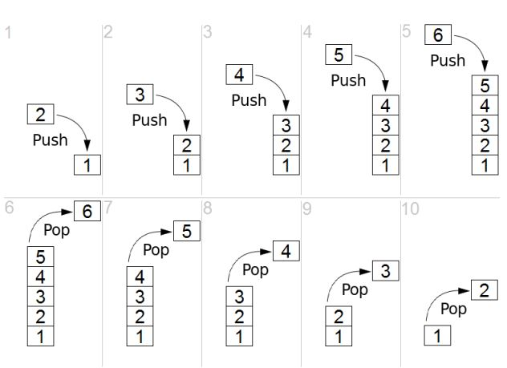

# 자료구조

### Stack(스택)

##### 정의
	Last in Firtst out(후입선출) 자료구조
	인터넷 페이지라고 생각하면 쉽다.(뒤로가기 버튼 누르면 가장 최근에 봤던 페이지로 이동)

##### 사용방법

	1. push, append(삽입): 리스트 마지막에 데이터 넣기 
						  마지막 위치 기억 변수 Top
	2. pop(삭제): 마지막 데이터 삭제 
	3. peek: 가장 마지막 데이터 읽기
	4. is_empty: 스택이 비어있는지 확인

### Queue(큐)

##### 정의
	First in First out(선입선출) 자료구조
	Enqueue(입력), Dequeue(출력) ==> Stack에서의 Push, Pop
	은행에서 번호표라고 생각하면 쉽다.

##### 사용방법

	1. Enqueue: 큐 맨 뒤에 데이터 추가, 
	2. Dequeue: 큐 맨 앞에 데이터 삭제
	3. Peak: front에 위치한 데이터 읽기(은행에서 다음 손님이 누구인지 확인)
	4. front: 큐 맨 앞의 위치(index) 번호
	5. rear: 큐 맨 뒤의 위치(index) 번호

### Dequeue(디큐)
			from collections import deque
			q = dequeue()    # 비어있는 큐
	        q = dequeue([1, 2, 3])   # 큐에 값있을 때

### Brute-force(완전탐색)

##### 정의
	가능한 방법을 모든 경우의 수를 다 해본다.

##### 완전탐색 방법
	1. Brute-Force: for문, if문을 이용해 처음부터 끝까지 탐색
	2. 비트마스크(비트연산): 이진법 활용
	3. 순열
	4. 백트래킹
	5. BFS, DFS

##### 조합

		python itertools 내장함수 사용
		itertools.combinations("원하는거", 몇개원하는지)
	
		ex)
		import itertools
		
		A = [1,2,3]
		B = itertools.combinations(A, 3)
		print(list(B))
				====>[(1, 2), (1, 3), (2, 3)]
				
		A = itertools.combinations('ABC', 2)
		print(list(A))
				===>[('A', 'B'), ('A', 'C'), ('B', 'C')]

##### BFS(Breadth First Search, 너비 우선탐색)
###### 정의
	한 노드에서 시작하여(통상 루트 노트) 다른 인접한 노드를 먼저 탐색하는 방법
	시작 정점으로부터 가까운 정점을 먼저 방문하고 멀리 떨어져 있는 정점을 나중에 방문(넓게 탐색)

###### 특징

	자료구조 큐(Queue)를 사용한다(선입선출 구조)
	탐색시 방문 노드 표시 하기

###### 구현

	백준 2178번 미로 탐색 (https://www.acmicpc.net/problem/2178)
	
	N, M = map(int, input().split())
	maze = [list(input()) for _ in range(N)]
	di = [-1, 0, 1, 0]
	dj = [0, 1, 0, -1]
	
	# 시간 계산
	maze[0][0] = 1
	
	# 맨처음 방문할 노드 
	q = [[0, 0]]
	
	# 방문할 노드가 있으면 while문
	while q:
	    # 방문 노드 하나 빼기(선입선출)
	    a, b = q.pop(0)
	
	    # 위아래양옆 체크
	    for x in range(4):
	        ni = a + di[x]
	        nj = b + dj[x]
	        # 이런 조건에 맞을 경우
	        if 0 <= ni < N and 0 <= nj < M and maze[ni][nj] == "1":
	            # q에 다음 노드 집어넣기
	            q.append([ni, nj])
	            # 방문한 노드는 전에 있던 곳에 시간 +1 해줘야됨
	            maze[ni][nj] = maze[a][b] + 1
	    
	
	    # 움직이는거 볼수있음
	    # for xxx in range(len(maze)):
	    #     print(maze[xxx])
	    # print()
	
	
	print(maze[-1][-1])
	

